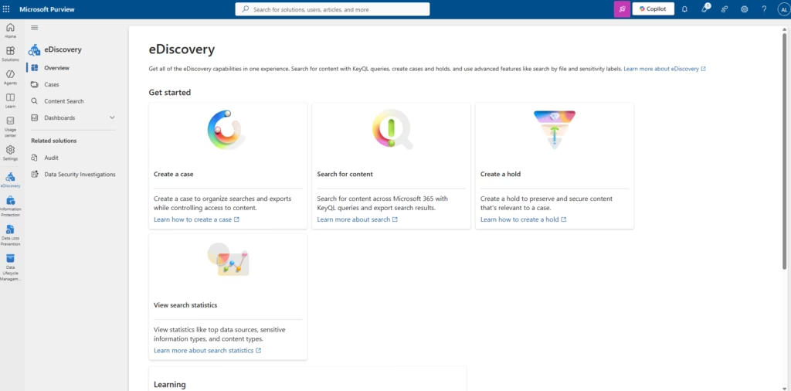
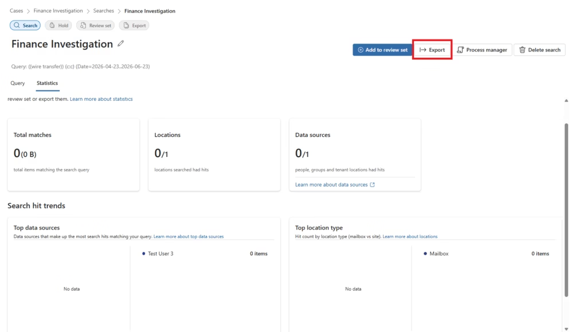

# Microsoft Purview eDiscovery

> Enterprise eDiscovery implementation — legal investigation case management, content search across Microsoft 365 workloads, and evidence export for legal and compliance teams — MS-102 implementation lab

[](LICENSE)
[](https://compliance.microsoft.com)
[]()
[](https://learn.microsoft.com/en-us/credentials/certifications/exams/ms-102)

---

## Enterprise Overview

Microsoft Purview eDiscovery enables organizations to search, collect, and export content stored across Microsoft 365 workloads in response to legal requests, compliance investigations, HR matters, and security incidents. By organizing investigation activities within cases, eDiscovery provides a structured, auditable workflow from search through to evidence delivery.

This repository documents an enterprise implementation of Microsoft Purview eDiscovery (Standard), demonstrating the full investigation lifecycle: case creation, data source configuration, KQL content search, result review, and export package delivery.

| Attribute | Value |
|---|---|
| Tenant | Microsoft 365 E5 Trial |
| eDiscovery Tier | eDiscovery Standard |
| Investigation | Finance Investigation |
| Data Sources | Exchange Online, SharePoint Online, OneDrive, Microsoft Teams |
| Search Type | KQL Keyword Query Language |
| Export Format | Evidence package (PST / CSV) |

> **Note:** This implementation uses eDiscovery Standard. Review Sets, Custodian Management, and Advanced Analytics require eDiscovery Premium (E5 / Purview Compliance Add-On) and were not validated during this implementation.

---

## Business Problem

| Challenge | Impact |
|---|---|
| Legal team requests all finance-related emails and documents within 48 hours | No centralized search capability — must manually search Exchange, SharePoint, Teams, OneDrive separately |
| HR investigation requires preservation of a departing employee's communications | No legal hold mechanism — account deletion destroys evidence |
| Security incident requires collection of all content matching specific keywords | Manual collection across workloads is inconsistent and risks missing evidence |
| Regulatory audit demands demonstrable ability to locate records on request | No documented, repeatable investigation process |
| External auditors require structured evidence packages | No export workflow producing legally admissible, structured evidence |

---

## Business Requirements

1. **Case-Based Investigation** — All investigation activities must be organized within a named case for auditability and team collaboration
2. **Multi-Workload Search** — A single search must span Exchange Online, SharePoint Online, OneDrive, and Microsoft Teams simultaneously
3. **KQL Precision** — Investigators must be able to build targeted queries using keywords, senders, date ranges, and file types
4. **Evidence Review** — Search results must be reviewed before export to verify relevance and scope
5. **Structured Export** — Evidence must be exportable as a structured package for legal team consumption
6. **Audit Trail** — All case activities, searches, and exports must generate an audit record

---

## Microsoft Solution

Microsoft Purview eDiscovery (Standard) addresses all requirements:

- **Cases** — Provide investigation containers with role-based access, search history, and export jobs
- **Content Search** — Unified search across Exchange, SharePoint, OneDrive, and Teams from a single interface
- **KQL (Keyword Query Language)** — Precise search using sender, subject, file type, date ranges, and phrase matching
- **Search Results Review** — Estimated item count and data size review before committing to export
- **Export Package** — Structured evidence package (PST + manifest) for legal team consumption
- **Audit Integration** — All eDiscovery case activities are captured in the Microsoft Purview Unified Audit Log

---

## Environment

| Component | Detail |
|---|---|
| Tenant | Microsoft 365 E5 Trial |
| Portal | compliance.microsoft.com → Solutions → eDiscovery |
| Case Name | Finance Investigation |
| Case Description | Investigation of finance-related emails and documents |
| Data Sources | Exchange Online, SharePoint Online, OneDrive, Microsoft Teams |
| Search Keywords | `from:finance@company.com AND "wire transfer"` |
| Test Note | Test tenant with limited sample data — search returned 0 matching items (expected in new tenants) |

---

## Architecture

```
  ┌────────────────────────────────────────────────────────────────────────┐
  │               MICROSOFT PURVIEW eDISCOVERY ARCHITECTURE                │
  │                    compliance.microsoft.com                             │
  └────────────────────────────────────────────────────────────────────────┘

  DATA SOURCES              eDISCOVERY CASE             INVESTIGATION TOOLS
  ┌──────────────┐         ┌──────────────────────┐    ┌──────────────────┐
  │ Exchange     │────────▶│                      │───▶│  Content Search  │
  │ Online       │         │  CASE CONTAINER      │    │  KQL Builder     │
  └──────────────┘         │  Finance Investigation│    │  Conditions      │
  ┌──────────────┐         │                      │    └──────────────────┘
  │ SharePoint   │────────▶│  Case Activities:    │    ┌──────────────────┐
  │ Online       │         │  • Searches          │───▶│  Results Review  │
  └──────────────┘         │  • Holds             │    │  Item count      │
  ┌──────────────┐         │  • Exports           │    │  Data size       │
  │ OneDrive     │────────▶│  • Audit Log         │    └──────────────────┘
  └──────────────┘         │                      │    ┌──────────────────┐
  ┌──────────────┐         │  Roles:              │───▶│  Export Package  │
  │ Microsoft    │────────▶│  eDiscovery Manager  │    │  PST / CSV       │
  │ Teams        │         │  eDiscovery Admin    │    │  Legal delivery  │
  └──────────────┘         └──────────────────────┘    └──────────────────┘
```

---

## Implementation Phases

### Phase 1 — Enable Microsoft Purview eDiscovery

Navigate to `compliance.microsoft.com → Solutions → eDiscovery`. Confirm eDiscovery (Standard) is available and the investigator account has the eDiscovery Manager role assigned.



**Prerequisites:**
- eDiscovery Manager or eDiscovery Administrator role (not automatically granted to Global Admins)
- Microsoft 365 E3, E5, or Business Premium license

### Phase 2 — Create Investigation Case

Create a named case to contain all investigation activities.


Select **Create a case** and configure:

| Field | Value |
|---|---|
| Case Name | Finance Investigation |
| Description | Investigation of finance-related emails and documents |


Case confirmed in the cases list after creation.


### Phase 3 — Configure Data Sources

Open the Finance Investigation case. Within the case, create a new search and select **Add sources** to configure the Microsoft 365 locations to search.


Select all relevant data sources:


| Data Source | Content Searched |
|---|---|
| Exchange Online | Mailbox emails, attachments, calendar items |
| SharePoint Online | Team sites, document libraries |
| OneDrive for Business | User files and folders |
| Microsoft Teams | Channel conversations, chats, shared files |

### Phase 4 — Build Content Search (KQL)

Configure the search query using the Condition Builder:


**Search Parameters:**

| Parameter | Value | Purpose |
|---|---|---|
| Keyword | `fraud OR payment OR transfer` | Broad keyword match |
| Sender | `from:finance@company.com` | Scope to finance sender |
| Subject | `subject:"invoice"` | Subject line matching |
| Date | `received>=2026-06-01` | Date range filter |
| File type | `filetype:docx` | Document type filter |

### Phase 5 — Execute and Review Results

Click **Run query**. The search scans all configured data sources and returns estimated item count and data size.


> **Lab Note:** This investigation was performed in a Microsoft 365 test tenant with limited sample data. The content search returned 0 matching items. This is expected behaviour in newly provisioned tenants where minimal user activity exists. The eDiscovery search workflow is identical regardless of result count.

### Phase 6 — Export Evidence

Select **Export Results** to package matching content for legal team delivery.



**Export options include:**
- All items including those with unrecognized format, encrypted, or not indexed
- Items excluding unrecognized format / encrypted / unindexed
- Only items with unrecognized format, encrypted, or not indexed

> **MS-102 Exam Note:** Use Microsoft Edge for the eDiscovery export function. Some export integrations may not work reliably in Google Chrome depending on tenant configuration.

### Phase 7 — Validation

Verify all case activities are captured in the eDiscovery case dashboard and the Microsoft Purview Unified Audit Log.

---

## Validation Results

| Test Case | Description | Result |
|---|---|---|
| TC-ED-01 | eDiscovery solution accessible at compliance.microsoft.com | ✅ Pass |
| TC-ED-02 | Finance Investigation case created successfully | ✅ Pass |
| TC-ED-03 | Case visible in eDiscovery cases list | ✅ Pass |
| TC-ED-04 | Data sources (Exchange, SharePoint, OneDrive, Teams) added to search | ✅ Pass |
| TC-ED-05 | KQL search query configured and executed | ✅ Pass |
| TC-ED-06 | Search results reviewed (0 items — expected in test tenant) | ✅ Pass |
| TC-ED-07 | Export screen accessed; export configuration available | ✅ Pass |

---

## PowerShell Automation

| Script | Purpose |
|---|---|
| `New-eDiscoveryCase.ps1` | Create an eDiscovery case with configurable name and description |
| `Get-eDiscoveryCases.ps1` | List all eDiscovery cases with status and creation details |
| `Export-eDiscoverySearch.ps1` | Initiate and monitor a search export job |

```powershell
# Create a new eDiscovery case
.\New-eDiscoveryCase.ps1 `
  -CaseName "Finance Investigation" `
  -Description "Finance-related emails and documents investigation" `
  -Members "investigator@yourtenant.onmicrosoft.com"
```

---

## eDiscovery Standard vs eDiscovery Premium

| Feature | eDiscovery Standard | eDiscovery Premium |
|---|---|---|
| Cases | ✅ | ✅ |
| Content Search | ✅ | ✅ |
| Export Results | ✅ | ✅ |
| KQL Query Language | ✅ | ✅ |
| Custodian Management | ❌ | ✅ |
| Review Sets | ❌ | ✅ |
| Advanced Analytics | ❌ | ✅ |
| Legal Hold (advanced) | Limited | ✅ |
| Licensing | E3, E5 | E5 / Purview Compliance Add-On |
| This Implementation | ✅ Standard | Not validated |

---

## Lessons Learned

1. **eDiscovery Manager role must be explicitly assigned** — Global Administrators are not automatically granted this role. Assign via compliance.microsoft.com → Permissions → Roles → eDiscovery Manager before attempting to create cases.
2. **Test tenants return 0 results** — Newly provisioned test tenants with minimal user activity will return empty search results. This does not indicate a configuration error — the workflow is correct.
3. **Use Microsoft Edge for export** — The eDiscovery export function uses a browser integration that may not work in Google Chrome. Always use Microsoft Edge for evidence export.
4. **Always use cases** — Running content searches outside a case provides no investigation audit trail and cannot be associated with a legal matter. Always create a case first.
5. **KQL precision prevents scope creep** — Broad keyword searches return thousands of irrelevant results. Use sender, subject, date range, and file type conditions to narrow scope from the start.

---

## Troubleshooting

| Issue | Cause | Resolution |
|---|---|---|
| eDiscovery not visible in portal | Missing role | Assign eDiscovery Manager role explicitly |
| Cannot create case | Insufficient permissions | Verify Compliance Administrator or eDiscovery Administrator role |
| Search returns unexpected 0 results | Test tenant / no data | Expected in new tenants; search config is correct |
| Export button does not respond | Browser incompatibility | Use Microsoft Edge for all export operations |
| Case not visible to other investigators | Role not assigned to case | Add investigators as case members within the case settings |

---

## Future Improvements

- [ ] Upgrade to eDiscovery Premium for Custodian Management and Review Sets
- [ ] Configure Legal Holds to preserve custodian content during active investigations
- [ ] Build Review Sets for attorney–client privilege review workflows
- [ ] Integrate case export with Azure Blob Storage for long-term evidence retention
- [ ] Implement automated case creation via PowerShell triggered by HR offboarding workflows
- [ ] Connect eDiscovery audit events to Microsoft Sentinel for SIEM visibility

---

## Repository Structure

```
Microsoft-Purview-eDiscovery/
├── README.md                              # This document
├── LICENSE                                # MIT License
├── .gitignore                             # Excludes export packages and credentials
├── GITHUB-METADATA.md                     # Repository metadata and push guide
├── WEBSITE-PORTFOLIO-CARD.md              # Portfolio card HTML block
├── architecture/
│   └── ediscovery-architecture.md         # 4 Mermaid architecture diagrams
├── docs/
│   ├── 01-overview.md                     # eDiscovery overview, standard vs premium
│   ├── 02-create-case.md                  # Case creation walkthrough
│   ├── 03-add-custodians.md               # Data source and custodian configuration
│   ├── 04-content-search.md               # KQL search configuration and execution
│   ├── 05-review-sets.md                  # Review Sets (Premium — not validated)
│   ├── 06-export-results.md               # Evidence export workflow
│   ├── 07-validation.md                   # 7 test cases
│   ├── troubleshooting.md                 # 5 common issues and resolutions
│   └── screenshots-placement-guide.md     # Screenshot index and placement map
├── images/
│   ├── 01-overview/                       # Portal overview screenshots
│   ├── 02-create-case/                    # Case creation screenshots
│   ├── 04-content-search/                 # Search configuration and results
│   └── 06-export-results/                 # Export screenshots
└── scripts/
    ├── New-eDiscoveryCase.ps1             # Case creation automation
    ├── Get-eDiscoveryCases.ps1            # Case inventory and status
    └── Export-eDiscoverySearch.ps1        # Search export automation
```

---

## References

- [Microsoft Purview eDiscovery Documentation](https://learn.microsoft.com/en-us/purview/ediscovery)
- [eDiscovery Standard Overview](https://learn.microsoft.com/en-us/purview/ediscovery-standard-get-started)
- [KQL Keyword Query Language Reference](https://learn.microsoft.com/en-us/purview/ediscovery-keyword-queries-and-search-conditions)
- [eDiscovery Roles and Permissions](https://learn.microsoft.com/en-us/purview/ediscovery-assign-permissions)
- [Export Search Results](https://learn.microsoft.com/en-us/purview/ediscovery-export-search-results)
- [MS-102 Exam Overview](https://learn.microsoft.com/en-us/credentials/certifications/exams/ms-102)
- [Blog: eDiscovery in Microsoft Purview Lab Guide](https://techcertguide.blog/ediscovery-in-microsoft-purview/)
