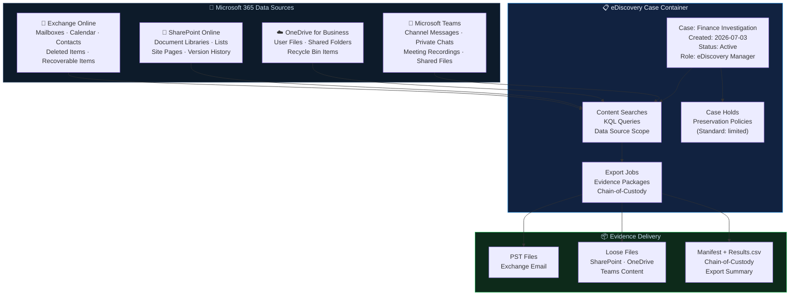
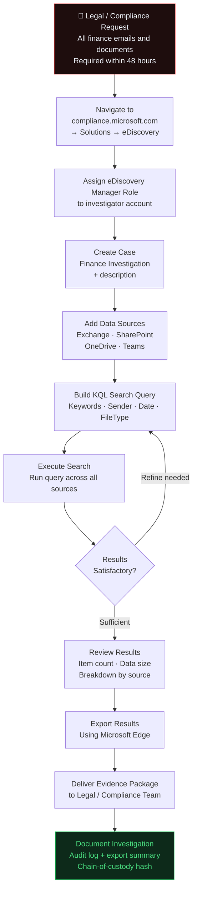
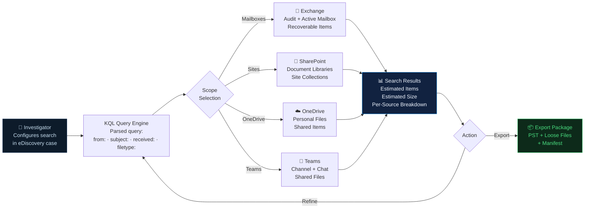
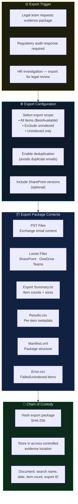

# Microsoft Purview eDiscovery — Architecture Diagrams

## Diagram 1 — Enterprise eDiscovery Architecture

---

## Diagram 2 — Investigation Workflow

---

## Diagram 3 — Content Search Flow

---

## Diagram 4 — Evidence Export Process

