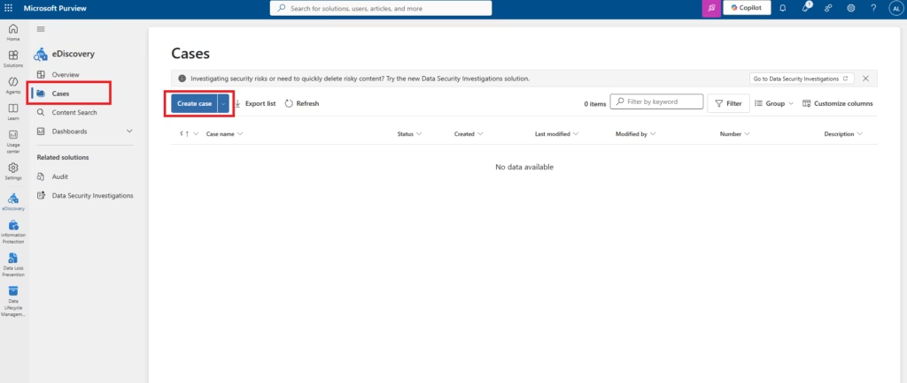
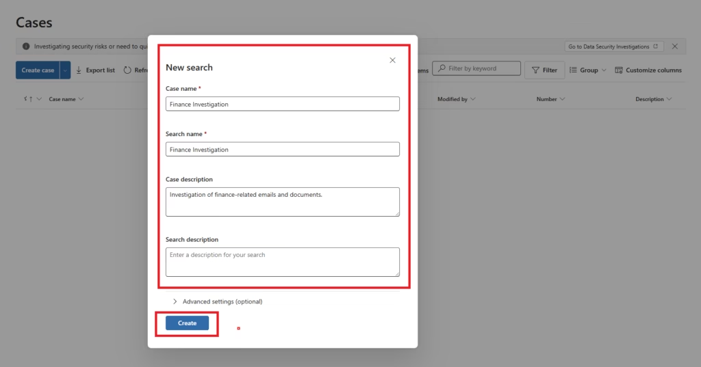
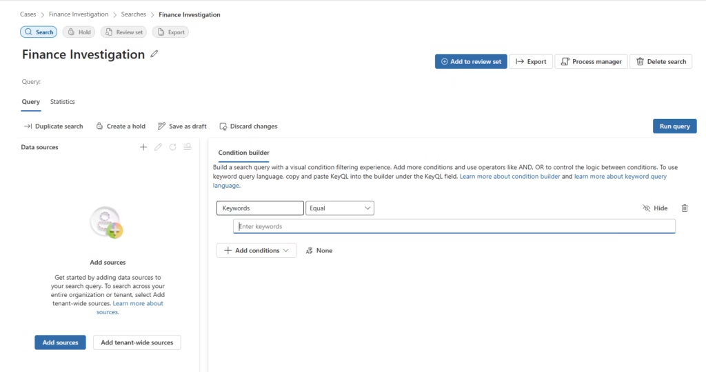

# Create an eDiscovery Case

## Overview

Cases are the foundational container in Microsoft Purview eDiscovery. All investigation activities — searches, holds, and exports — are performed within a case. Cases provide role-based access control, investigation history, and audit trail.

---

## Prerequisites

| Requirement | Detail |
|---|---|
| Role | eDiscovery Manager or eDiscovery Administrator |
| License | Microsoft 365 E3, E5, or Business Premium |
| Portal | compliance.microsoft.com |

---

## Step 1: Navigate to eDiscovery

1. Navigate to `compliance.microsoft.com`
2. Select **Solutions → eDiscovery → Standard**
3. The eDiscovery (Standard) cases list is displayed

---

## Step 2: Create a New Case

1. Select **Create a case**
2. Configure the case:

| Field | Value |
|---|---|
| Case Name | Finance Investigation |
| Description | Investigation of finance-related emails and documents |

3. Select **Create**

---

## Step 3: Confirm Case Creation

The new case appears in the cases list with status Active.

---

## Case Naming Best Practices

| Practice | Rationale |
|---|---|
| Use descriptive names | `Finance-Investigation-2026` rather than `Case-001` |
| Include date or version | Supports audit documentation and case archival |
| Create separate cases per matter | Prevents investigation scope creep and simplifies reporting |
| Document purpose in description | Provides context for other case members and auditors |

---

## Case Access Control

After case creation, add other investigators as case members:

1. Open the case
2. Select **Settings → Access & permissions**
3. Add users with the eDiscovery Manager role

Only case members and eDiscovery Administrators can access case content.
