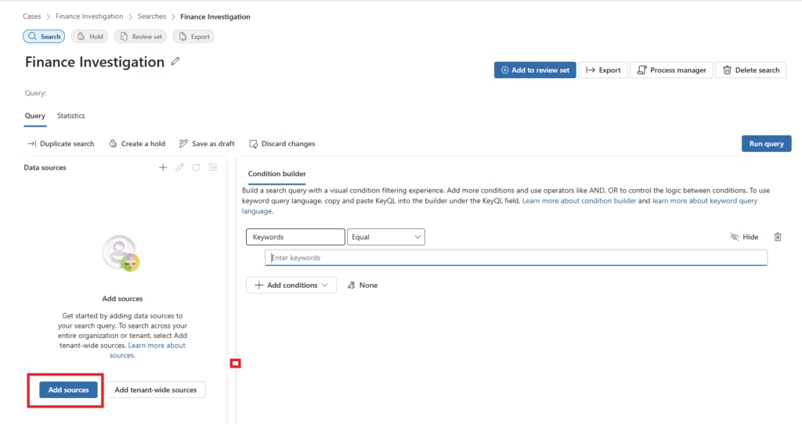
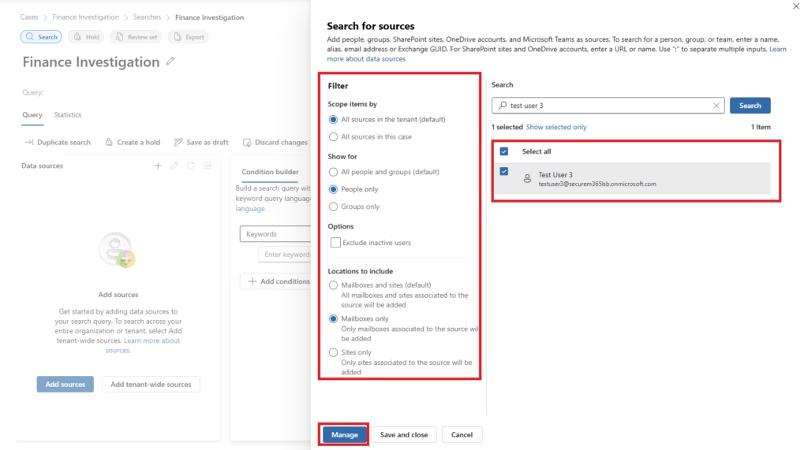

# Configure Data Sources and Custodians

## Overview

In eDiscovery Standard, data sources are configured directly within each content search by selecting Microsoft 365 locations to include. The **Add sources** function allows investigators to specify which mailboxes, sites, and workloads the search will query.

> **Note:** Formal Custodian Management (associating specific individuals with holds and searches, and tracking their content across workloads) is an eDiscovery Premium feature. This implementation uses eDiscovery Standard — data sources are configured per search using the Add sources function.

---

## Configuring Data Sources

### Step 1: Open the Case

Navigate to the Finance Investigation case and create a new search within the case.

### Step 2: Add Data Sources

After creating the search, select **Add sources** to configure which Microsoft 365 locations will be included.

### Step 3: Select Data Locations

The data source panel allows selection of specific locations:

| Data Source | Content Included |
|---|---|
| Exchange Online | All mailbox emails, calendar, contacts, attachments |
| SharePoint Online | All team sites, document libraries, and pages |
| OneDrive for Business | All user OneDrive files and folders |
| Microsoft Teams | Channel messages, private chats, meeting recordings, shared files |
| Specific User | Target a single user's mailbox and OneDrive |

---

## Scope Recommendations

| Scenario | Recommended Scope |
|---|---|
| Employee investigation | Single user — mailbox + OneDrive + Teams chats |
| Department investigation | All users in a specific department |
| Keyword-driven broad search | All mailboxes and sites |
| Contract dispute | Specific SharePoint site + relevant user mailboxes |

**Best Practice:** Always limit scope to relevant users and locations. Broad searches across all mailboxes and sites increase search time and produce larger result sets that are harder to review.

---

## eDiscovery Premium — Custodian Management

eDiscovery Premium introduces formal custodian management:

- **Custodians** — Specific individuals whose content is relevant to the investigation
- **Custodian holds** — Places content on legal hold to prevent deletion
- **Non-custodial data sources** — SharePoint sites or mailboxes not tied to a specific individual

> These features were not validated in this Standard implementation. Custodian Management requires Microsoft 365 E5 or the Microsoft Purview Compliance add-on.
