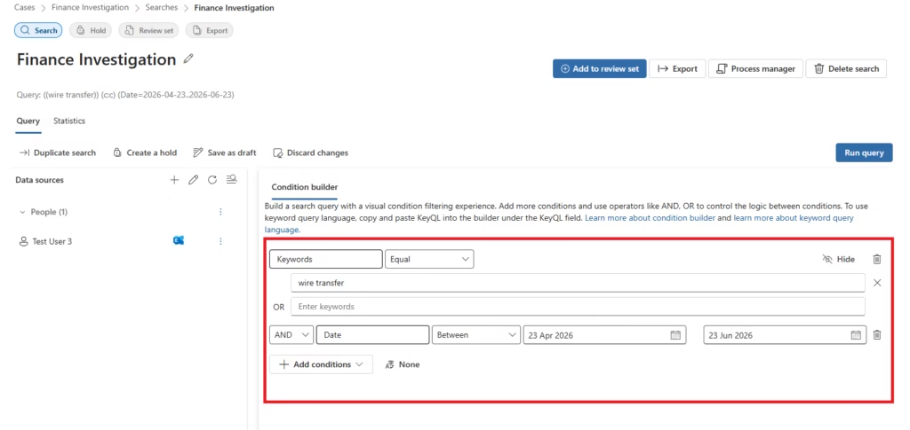
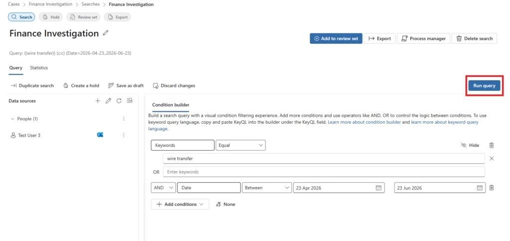

# Content Search — KQL Query Configuration

## Overview

Content Search is the core investigative function within an eDiscovery case. Investigators configure queries using Keyword Query Language (KQL), select data source locations, apply conditions (sender, date, file type), and execute the search to retrieve matching content.

---

## Search Configuration

### Step 1: Create a Search Within the Case

Open the Finance Investigation case and create a new search. Provide a descriptive name for the search that identifies the investigation scope.

### Step 2: Build the Search Query

The search builder provides a Condition Builder (right panel) for constructing KQL queries without writing raw syntax.



---

## KQL Query Examples

### Option A — Simple Keyword Search

```kql
fraud OR payment OR transfer
```

Returns all content containing any of these terms across all configured data sources.

### Option B — Advanced KQL (Recommended for Investigations)

```kql
from:finance@company.com AND subject:"invoice" AND "wire transfer"
```

| KQL Property | Example | Description |
|---|---|---|
| `from:` | `from:finance@company.com` | Filter by sender address |
| `subject:` | `subject:"invoice"` | Filter by email subject |
| `"phrase"` | `"wire transfer"` | Exact phrase match |
| `filetype:` | `filetype:docx` | Filter by file extension |
| `received>=` | `received>=2026-06-01` | Date range — after date |
| `received<=` | `received<=2026-07-01` | Date range — before date |
| `AND` | `keyword1 AND keyword2` | Both terms must match |
| `OR` | `fraud OR transfer` | Either term matches |
| `NOT` | `payment NOT refund` | Exclude term |

### Option C — Condition Filters

Use **Add conditions** to add structured filters alongside the keyword query:

| Condition | Purpose |
|---|---|
| Sender / Author | Restrict to communications from specific identities |
| Date | Filter to a specific time window |
| File Type | Restrict to specific document types |
| Subject | Filter by email subject line |
| Recipients | Restrict to specific email recipients |

---

## Step 3: Execute the Search

Click **Run query** to execute the search across all configured data sources.



**Search results display:**
- Estimated number of matching items
- Estimated data size (MB / GB)
- Breakdown by location (mailboxes, sites)

> **Lab Note:** This search was performed in a Microsoft 365 test tenant with limited sample data. The search returned **0 matching items**. This is expected behaviour in newly provisioned test tenants where minimal user activity exists. The eDiscovery search workflow and configuration are identical regardless of the number of returned items.

---

## Search Performance Tips

| Tip | Rationale |
|---|---|
| Use specific date ranges | Narrow date windows reduce scan scope and improve performance |
| Specify users | Per-user scope reduces query surface significantly |
| Use `AND` over `OR` | `AND` narrows results; `OR` expands them |
| Avoid wildcard-only queries | `*` returns everything and is not a valid KQL standalone query |
| Name searches descriptively | `Finance-Emails-June2026` is more useful than `Search 1` |
